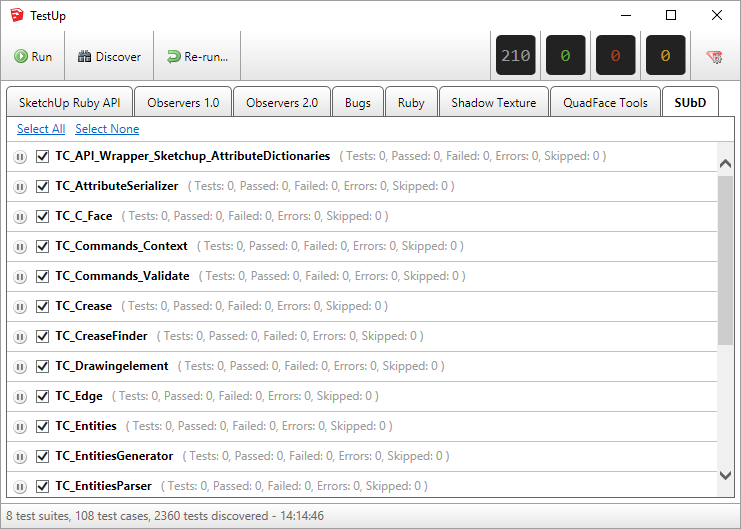

TestUp 2 for SketchUp
=====================

TestUp is a wrapper on top of the [minitest](https://github.com/seattlerb/minitest) gem. It allow SketchUp Extension developers to write `minitest` tests that runs within SketchUp.



Requirements
------------

1. SketchUp 2014 or newer.

Setup for Extension Developers
------------------------------

Easy: Download RBZ from the [Releases tab on GitHub](https://github.com/SketchUp/testup-2/releases).

Latest: Install TestUp from `git` source (See Setup for Contributing). Requires [Node](https://nodejs.org) to build webdialog content before 2.3+ versions can be used.

Check out the [wiki](https://github.com/SketchUp/testup-2/wiki) for details on creating tests. Make sure to also refer to [minitest documentation](http://docs.seattlerb.org/minitest/).

Examples of extension projects implementing TestUp tests:
* https://bitbucket.org/thomthom/quadface-tools/src
* https://github.com/thomthom/shadow-texture/tree/dev-vscode-debug

Setup for Contributing/Running from Source
------------------------------------------

TestUp require [NodeJS](https://nodejs.org) to build webdialog resources: https://nodejs.org/en/ (Version 10.4 was used to build TestUp 2.3)

1. Fork the project to your own GitHub account. This is important so that we can do code review on changes done.
_No **not** push directly to the main repository._

2. Clone your fork to your computer.

3. Open a command line at the project root:
    1. `npm install`
    2. `npm run build`

    You can also use `npm run build -- --watch` to automatically rebuild whenever files changes.

4. Add a helper Ruby file in your Plugins folder:

```ruby
# load_testup.rb
# This adds the source directory to Ruby's search path and
# loads TestUp 2.
$LOAD_PATH << "C:/Users/YourUserName/Documents/testup-2/src"
require "testup.rb"
```

Optionally you can download a RBZ from the [Releases tab on GitHub](https://github.com/SketchUp/testup-2/releases). Beware that this might not be
always up to date. Setting up from git is recommended in order to easily keep
up to date.

Setup for SketchUp Internal Development
---------------------------------------

Follow the same steps as for "Setup for Contributing".

In order to load tests from our source code the paths where our tests are
needs to be updated. This is done from the Preference dialog found under the
TestUp dialog.

Click the gear symbol and you should see a list of paths. By default these will
be pointing to the git repository's copy of our tests.

Logging and Re-running
----------------------

TestUp will log the details of a test-run. These can be found by using the menu
`Extensions > TestUp > Open Log Folder`.

In there you will find `.log` and `.run` files.

The `.log` files are for human reading, containing information about the
environment and what tests ran.

The `.run` files are JSON files which can be used to re-play a test-run. From
the TestUp main dialog, click the `Re-run...` button and select the `.run` file
you are interested in. This will re-run the exact same tests with the same seed
so they are also run in the same order.

If you need to re-run a particular run several times you can use
`Extensions > TestUp > Saved Runs > Add Run`. Then you can pick it from the
drop-down after choosing `Extensions > TestUp > Saved Runs > Set Re-play Run`.

Credits
-------

Thanks to Mark James for making his excellent icon set "Silk" available. Portions of the set is used in this project. Some file names has been renamed and some icons where mixed to create new status indicators for test result.
http://www.famfamfam.com/lab/icons/silk/

License
-------

The MIT License (MIT)

See the LICENSE file for details.
